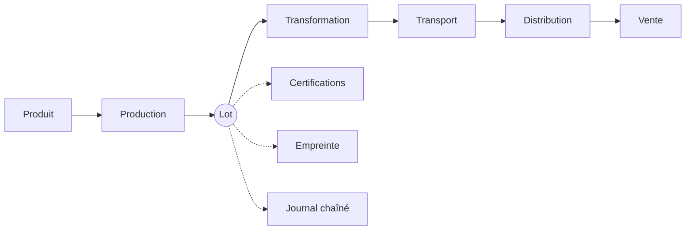
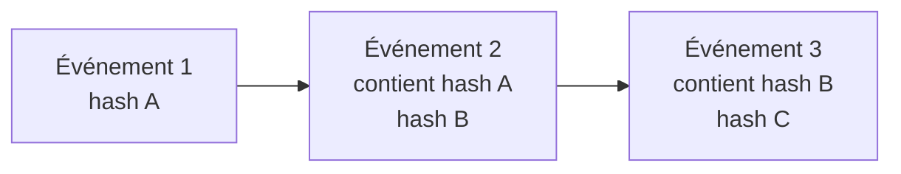

<div align="center">

# 🌱 NutriTrace

### De la ferme à l'assiette, sans rien devoir croire sur parole.

Traçabilité alimentaire **vérifiable**, empreinte environnementale et détection du greenwashing — le tout accessible en scannant un QR code.


</div>

<!--
Ajoutez ici une capture d'écran de la page de traçabilité :

-->

---

## 💡 Le problème

Sur un emballage, « local », « bio » ou « durable » ne sont que des mots. Rien ne dit d'où vient réellement le produit, ce qu'il a traversé, ni si ces promesses sont prouvées.

**NutriTrace répond à quatre questions :**

| | |
|---|---|
| 📍 **D'où ça vient ?** | Le parcours complet, des fermes d'origine au rayon, sur une carte. |
| 🔗 **Que s'est-il passé ?** | Un journal d'événements dont toute falsification est détectable. |
| 🌍 **Quel impact ?** | Une note de A à E (CO₂, eau, énergie, distance). |
| ✅ **Peut-on y croire ?** | Un score de transparence sur 100 et des alertes quand une promesse est contredite par les faits. |

## 🧭 Comment ça marche

1. Un **producteur** enregistre une production : le lot et son QR code sont créés automatiquement.
2. Le lot voyage : **transformation**, **transport**, **distribution**, **vente**. Chaque étape est confirmée par le destinataire.
3. Chaque étape alimente le journal de traçabilité, l'empreinte et le score.
4. Le **consommateur** scanne le QR code et voit tout, sans compte.

Le **lot** est l'objet central du système :



## ✨ Ce qui rend le projet différent

### 🔐 Un journal qui ne se laisse pas réécrire

Chaque événement embarque l'empreinte SHA-256 du précédent. Modifier une ligne en base casse tous les maillons suivants, et la page publique affiche alors une chaîne « rompue ».



Les événements sont en ajout seul : une correction est un **nouvel** événement, jamais une modification.

### 🕵️ Anti-greenwashing mesuré, pas déclaratif

- **« Local »** : calculé d'après la distance réelle ferme → lieu de vente (≤ 150 km). Une mention « local » au-delà de 250 km déclenche une alerte publique.
- **« Bio »** : exige un certificat **vérifié** par l'administration, avec justificatif et date de validité.
- Les incohérences (dates, lieux, certificats expirés ou refusés, signalements ouverts) **pénalisent le score** et s'affichent publiquement.

### 📊 Des scores expliqués

Chaque score détaille ses composantes. Chaque valeur indique son origine : **mesurée**, **déclarée** ou **calculée**.

| Score | Échelle | Principe |
|---|---|---|
| Empreinte | A → E | CO₂ 40 %, eau 20 %, énergie 20 %, distance 20 %, ramenés au kg |
| Transparence | 0 → 100 | parcours complet (25), acteurs vérifiés (20), certifications (20), données chiffrées (20), intégrité du journal (15), moins les pénalités |

> [!IMPORTANT]
> Les facteurs d'émission sont des valeurs **simplifiées à but pédagogique** : un ordre de grandeur, pas un bilan carbone certifié. Ils se règlent dans `config/footprint.php` et `config/trust.php`, ou depuis l'interface administrateur (recalcul immédiat).

## 👥 Qui fait quoi

| Rôle | Peut |
|---|---|
| 🌾 Producteur | Gérer ses produits, enregistrer des productions, expédier des lots, déposer des certifications |
| 🏭 Transformateur | Réceptionner des lots, les transformer en nouveaux lots |
| 🏪 Distributeur | Réceptionner, mettre en rayon, enregistrer les ventes |
| 🛒 Consommateur | Scanner, comparer, noter, signaler |
| 🛡️ Administrateur | Valider les comptes professionnels, revoir les certifications, régler les calculs, consulter l'audit |

## 🚀 Installation

**Prérequis** : PHP 8.3+ (`pdo_mysql`, `gd`, `intl`, `zip`, `fileinfo`), Composer, Node.js 20+, MySQL 8 ou MariaDB 10.4+.

```bash
git clone <url-du-depot> nutritrace
cd nutritrace

composer install
npm install
cp .env.example .env
php artisan key:generate
```

Créez une base vide `nutritrace`, vérifiez les identifiants dans `.env`, puis :

```bash
php artisan migrate:fresh --seed
php artisan storage:link
composer dev
```

➡️ Ouvrez <http://localhost:8000>.

> [!TIP]
> Par défaut, les e-mails sont écrits dans `storage/logs/laravel.log` (`MAIL_MAILER=log`). Le lien de vérification s'y trouve. En développement, `php artisan user:verify {email}` valide une adresse directement.

## 🎬 Essayer le projet

Le seed crée un écosystème complet : **23 produits, 57 lots, 300+ événements, 19 certifications**. Tout passe par les vrais services de l'application, donc empreintes et scores sont réellement calculés. Les organisations sont fictives.

> [!WARNING]
> Mot de passe de tous les comptes de démonstration : `password`. Ne jamais les déployer en production.

| Compte | Rôle |
|---|---|
| `admin@nutritrace.test` | 🛡️ Administrateur |
| `producteur@nutritrace.test` | 🌾 Producteur (olives, Sfax) |
| `transformateur@nutritrace.test` | 🏭 Transformateur (huilerie, Sfax) |
| `distributeur@nutritrace.test` | 🏪 Distributeur (Tunis) |
| `consommateur@nutritrace.test` | 🛒 Consommateur |

**Lots à ouvrir** depuis la recherche de la page d'accueil :

- `LOT-2025-006` : huile d'olive, le parcours de référence (ferme → huilerie → Tunis).
- `LOT-2025-003` : une mention « local » contredite par la distance.
- `LOT-2026-004` : une mention « bio » sans certificat valide.
- `LOT-2026-008` : un miel au score de transparence maximal.

## 🔌 API

```http
GET /api/v1/trace/{jeton_public}
```

Renvoie en JSON le lot, son parcours, l'état de la chaîne d'empreintes, l'empreinte, les certifications, le score de transparence et les alertes. Lecture seule, **60 requêtes/minute**, et seuls le nom et la ville des organisations sont exposés.

```bash
curl http://localhost:8000/api/v1/trace/{jeton_public}
```

## 🏗️ Sous le capot

| | |
|---|---|
| **Backend** | PHP 8.3, Laravel 13, Breeze adapté (rôles, statuts de compte) |
| **Données** | MySQL 8 / MariaDB (SQLite en mémoire pour les tests) |
| **Front** | Blade + Vite ; SB Admin 2 (back office), Bootstrap 5, Chart.js, Leaflet (site public) |
| **QR codes** | `simplesoftwareio/simple-qrcode` |

Principes de code : contrôleurs fins, **Form Requests** pour la validation, **Policies** pour les droits, **Enums** pour les statuts, **Services** pour la logique métier (`app/Services`, dont `Scoring/` et `Traceability/`) et **Observers** pour les effets entre modules (créer une production crée son lot et son premier événement, chaque étape déclenche le recalcul des scores). Les routes sont découpées par module dans `routes/modules/`.

## 🧪 Tests et commandes

```bash
php artisan test
```

144 tests sur SQLite en mémoire, sans configuration : authentification, rôles, flux logistique complet, chaîne d'empreintes et détection de falsification, calculs, site public, API.

| Commande | Effet |
|---|---|
| `php artisan make:admin` | Crée un administrateur |
| `php artisan scores:refresh` | Recalcule tous les scores |
| `php artisan certifications:expire` | Expire les certifications dépassées (planifié chaque nuit) |
| `php artisan schedule:work` | Lance le planificateur en local |
| `php artisan db:seed --class=VolumeSeeder` | Ajoute le jeu de données étendu sans rien effacer |

## ⚠️ Limites connues

- Un lot s'envoie en entier (pas de fractionnement).
- Les distances automatiques sont à vol d'oiseau ; la distance routière se saisit à la main.
- Les justificatifs et images de démonstration sont fictifs.

## 📄 Licence

Projet académique sous licence [MIT](LICENSE). Les modèles d'interface [Start Bootstrap](https://startbootstrap.com) utilisés sont également sous licence MIT (fichiers conservés dans `resources/assets/css/`).
